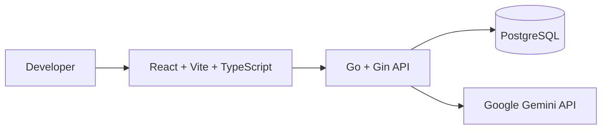

# GITGUD


> **Practice. Build. Improve.**

GITGUD is an AI-powered developer learning workspace designed to help developers improve their backend engineering skills through practical coding challenges, AI-assisted feedback, and measurable progress tracking.

---

## Preview


---

## About

GITGUD is a full-stack learning platform focused on **practical backend engineering**.

Instead of relying primarily on passive learning through videos, articles, or tutorials, GITGUD encourages developers to learn by solving problems that resemble real backend development scenarios.

Developers can:

- Explore backend engineering topics
- Practice through structured coding challenges
- Submit their solutions
- Receive AI-assisted feedback
- Track XP and learning progress
- Review their practice history
- Manage their profile and account

The project is also developed as a software engineering portfolio, with an emphasis on architecture, documentation, clean code organization, and production deployment.

---

# Why GITGUD?

Learning backend engineering is not only about understanding concepts.

Developers need to repeatedly apply those concepts to real problems.

GITGUD focuses on a simple learning loop:

```text
Learn
  ↓
Practice
  ↓
Submit
  ↓
Receive Feedback
  ↓
Review Progress
  ↓
Improve
```

The goal is to make backend learning more **active, measurable, and practical**.

---

# Features

## Authentication

GITGUD provides authentication functionality including:

- User registration
- User login
- JWT authentication
- Protected API endpoints
- Logout
- Password management

---

## Dashboard

The dashboard provides an overview of the developer's learning activity.

It includes information such as:

- Current level
- XP
- Learning progress
- Practice statistics
- Recent activity
- Learning streak
- Accuracy

---

## Backend Practice

Developers can practice backend engineering concepts through structured challenges.

Current learning topics include:

- REST API
- Authentication
- JWT
- PostgreSQL
- Docker
- Middleware
- Database Design
- Clean Architecture
- Caching

---

## Practice Submission

Users can submit their answers after completing a challenge.

The system tracks:

- Score
- Correct answers
- Incorrect answers
- XP earned
- Level progression
- Practice duration

---

## AI-Powered Learning

GITGUD integrates Google Gemini to support the learning experience.

AI can be used to provide:

- Challenge generation
- Explanations
- Hints
- Feedback
- Improvement suggestions

The goal is not to replace the learning process, but to provide developers with additional guidance while practicing.

---

## Progress Tracking

Developers can monitor their learning progress through:

- XP
- Level
- Accuracy
- Completed practices
- Practice history
- Recent activity
- Learning streak

---

## Profile & Account Management

Users can manage their account through the profile and settings pages.

Available functionality includes:

- View profile
- View learning statistics
- View recent activity
- Update profile information
- Change password

---

# System Architecture



---

## Request Flow

```text
Browser
   │
   ▼
React Frontend
   │
   │ HTTP / REST API
   ▼
Go Backend
   │
   ├── Authentication
   ├── Dashboard
   ├── Practice
   ├── Submission
   ├── Profile
   └── Progress
   │
   ├──────────────► PostgreSQL
   │
   └──────────────► Google Gemini
```

---

# Tech Stack

| Layer | Technology |
|---|---|
| Frontend | React 19 |
| Language | TypeScript |
| Build Tool | Vite |
| Styling | Tailwind CSS |
| HTTP Client | Axios |
| Backend | Go |
| Web Framework | Gin |
| Authentication | JWT |
| Database | PostgreSQL |
| AI | Google Gemini API |
| Containerization | Docker |
| Frontend Deployment | Vercel |
| Backend Deployment | Vercel |

---

# Project Structure

```text
gitgud/

├── frontend/
│   ├── src/
│   │   ├── api/
│   │   ├── components/
│   │   ├── pages/
│   │   ├── services/
│   │   ├── types/
│   │   └── ...
│   │
│   └── package.json
│
├── backend/
│   ├── cmd/
│   │   └── api/
│   │
│   ├── internal/
│   │   ├── handler/
│   │   ├── middleware/
│   │   ├── service/
│   │   ├── repository/
│   │   └── ...
│   │
│   ├── go.mod
│   └── ...
│
├── docs/
│   ├── product/
│   ├── wireframes/
│   ├── architecture/
│   └── decisions/
│
├── README.md
├── README_ID.md
├── LICENSE
└── .gitignore
```

---

# Documentation

Project documentation is maintained inside the `docs/` directory.

```text
docs/

├── product/
│   ├── vision.md
│   ├── branding.md
│   ├── product-requirements.md
│   ├── sitemap.md
│   ├── user-flow.md
│   └── design-system.md
│
├── wireframes/
│   ├── landing.md
│   ├── login.md
│   ├── workspace.md
│   ├── history.md
│   ├── progress.md
│   ├── profile.md
│   └── settings.md
│
├── architecture/
│
└── decisions/
```

The documentation covers:

- Product vision
- Product requirements
- User flows
- Sitemap
- Design system
- Wireframes
- System architecture
- Architecture decisions

---

# Getting Started

## Prerequisites

Make sure the following tools are installed:

- Git
- Node.js
- npm
- Go
- PostgreSQL

---

## Clone Repository

```bash
git clone https://github.com/davidkhasbiya/gitgud.git

cd gitgud
```

---

# Frontend

Navigate to the frontend directory:

```bash
cd frontend
```

Install dependencies:

```bash
npm install
```

Run the development server:

```bash
npm run dev
```

Frontend will be available at:

```text
http://localhost:5173
```

---

# Backend

Open another terminal and navigate to the backend directory:

```bash
cd backend
```

Install Go dependencies:

```bash
go mod tidy
```

Run the API server:

```bash
go run cmd/api/main.go
```

Backend will be available at:

```text
http://localhost:8080
```

---

# Environment Variables

## Frontend

Create an environment file:

```text
frontend/.env
```

For local development:

```env
VITE_API_URL=http://localhost:8080/api/v1
```

For production:

```env
VITE_API_URL=https://gitgud-backend.vercel.app/api/v1
```

> Production environment variables should be configured through the deployment platform rather than committed to the repository.

---

## Backend

Configure the required environment variables:

```env
DATABASE_URL=
JWT_SECRET=
GEMINI_API_KEY=
```

Never commit secrets, API keys, database credentials, or production credentials to the repository.

---

# API

The backend exposes RESTful endpoints under:

```text
/api/v1
```

Main API areas include:

```text
/api/v1/auth
/api/v1/dashboard
/api/v1/profile
/api/v1/progress
/api/v1/practices
/api/v1/submissions
/api/v1/settings
```

Authentication-protected endpoints use:

```http
Authorization: Bearer <token>
```

---

# Deployment

GITGUD is deployed as a separate frontend and backend application.

```text
                    ┌─────────────────────┐
                    │      Developer       │
                    └──────────┬──────────┘
                               │
                               ▼
                    ┌─────────────────────┐
                    │   React Frontend    │
                    │       Vercel        │
                    └──────────┬──────────┘
                               │
                               │ REST API
                               ▼
                    ┌─────────────────────┐
                    │    Go + Gin API     │
                    │       Vercel        │
                    └──────────┬──────────┘
                               │
                     ┌─────────┴─────────┐
                     ▼                   ▼
              ┌──────────────┐   ┌────────────────┐
              │  PostgreSQL  │   │ Google Gemini  │
              └──────────────┘   └────────────────┘
```

## Production

### Frontend

```text
https://gitgud-dev.vercel.app
```

### Backend

```text
https://gitgud-backend.vercel.app
```

The production backend is configured with CORS to allow requests from the deployed frontend.

---

# Development Status

GITGUD is currently in the **MVP / active development** stage.

The core application flow is already implemented and deployed.

## Completed

- [x] Product documentation
- [x] Product requirements
- [x] Wireframes
- [x] Architecture planning
- [x] Architecture decision records
- [x] Frontend foundation
- [x] Backend API foundation
- [x] Authentication
- [x] JWT authorization
- [x] Dashboard
- [x] Profile
- [x] Progress tracking
- [x] Practice system
- [x] Practice submission
- [x] Account settings
- [x] PostgreSQL integration
- [x] AI integration foundation
- [x] Production frontend deployment
- [x] Production backend deployment
- [x] CORS configuration
- [x] Production API integration

---

## In Progress

- [ ] Improve AI challenge generation
- [ ] Improve AI feedback quality
- [ ] Expand backend learning paths
- [ ] Improve challenge difficulty system
- [ ] Improve dashboard analytics
- [ ] Add automated testing
- [ ] Improve CI/CD
- [ ] Monitoring and observability

---

# Roadmap

## Short Term

- Improve challenge generation
- Improve AI feedback
- Add more backend challenges
- Improve learning analytics
- Improve error handling
- Add automated tests
- Improve API documentation

## Medium Term

- Challenge difficulty progression
- More advanced backend topics
- Personalized challenge recommendations
- Developer leaderboard
- More detailed learning analytics
- Achievement system

## Long Term

- Personalized learning paths
- Advanced AI tutoring
- Community challenges
- Collaborative learning
- Developer competitions
- Community-driven challenge creation

---

# Design Philosophy

> **Low Noise. High Function.**

GITGUD follows a developer-first interface inspired by modern developer tools.

## Principles

- Minimal
- Functional
- Accessible
- Responsive
- Content-first
- Developer-focused

## Inspiration

The visual direction is inspired by:

- GitHub
- Linear
- Vercel
- Cursor
- Raycast

The goal is to create an interface that feels familiar to developers while keeping the learning experience focused.

---

# Engineering Principles

GITGUD is developed with an emphasis on:

- Clean project structure
- Separation of concerns
- RESTful API design
- Authentication and authorization
- Environment-based configuration
- Reusable frontend services
- Typed frontend models
- Modular backend architecture
- Documentation-driven development
- Incremental development
- Production validation

The project prioritizes maintainability and clarity over unnecessary complexity.

---

# AI Assistance

GITGUD is developed with assistance from AI tools.

AI tools used during development include:

- ChatGPT
- Google Gemini

AI is used for:

- Brainstorming
- Documentation
- Architecture discussions
- Code review
- Debugging
- Implementation assistance
- UX and product exploration

However, architecture decisions, implementation choices, debugging, testing, and final validation remain the responsibility of the project author.

---

# License

This project is licensed under the MIT License.

See the [LICENSE](LICENSE) file for more information.
