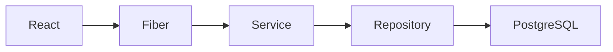

# Backend Architecture

Tech Stack

- Go
- Fiber
- PostgreSQL
- JWT
- Gemini API

---

# Folder Structure

cmd/

internal/

config/

database/

handlers/

middleware/

models/

repositories/

services/

routes/

utils/

---

# Layer

Client

↓

Handler

↓

Service

↓

Repository

↓

Database

---

# Architecture

