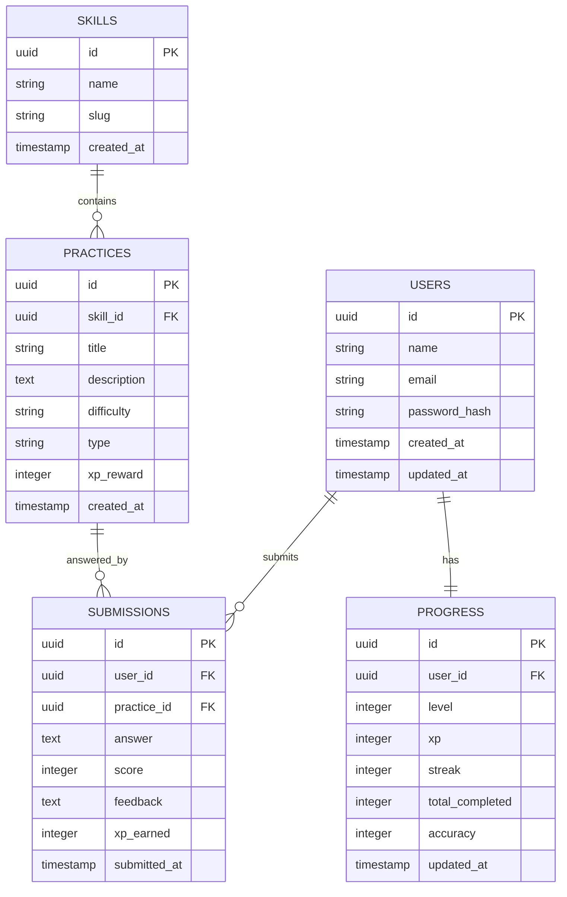

# Database

Database

PostgreSQL

ORM

SQLC

Migration

Goose

---

# Entity Relationship Diagram

---

# Notes

Each user has one progress record.

Each challenge belongs to one track.

Each submission belongs to one user.

Each submission belongs to one challenge.