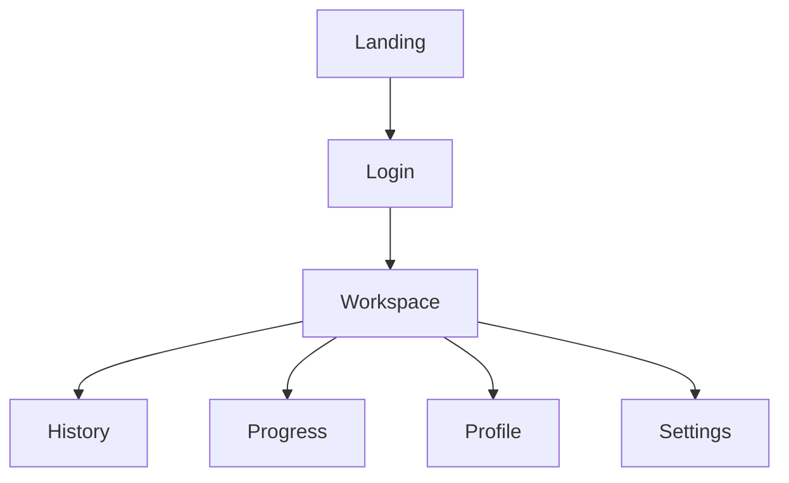

# Frontend Architecture

Version: 1.0

Status: Draft

---

# Overview

GITGUD frontend is built using React and Vite.

The application focuses on a clean, minimal, and developer-first experience.

---

# Tech Stack

- React
- Vite
- TypeScript
- Tailwind CSS
- React Router
- TanStack Query
- Zustand
- Axios
- React Hook Form
- Zod
- Lucide React

---

# Project Structure

```text
src/

assets/

components/

features/

hooks/

layouts/

lib/

pages/

routes/

services/

stores/

types/

utils/

App.tsx

main.tsx
```

---

# Folder Responsibilities

## assets

Images

Fonts

Icons

---

## components

Reusable UI

Example

Button

Card

Input

Modal

Navbar

Sidebar

---

## features

Business logic

Example

Authentication

Workspace

Challenge

History

Progress

---

## hooks

Custom React Hooks

---

## layouts

Landing Layout

Dashboard Layout

Auth Layout

---

## pages

Landing

Login

Workspace

History

Profile

Settings

---

## services

HTTP Client

API Functions

---

## stores

Global State

Theme

Authentication

User

---

## utils

Helper Functions

---

# Routing



---

# State Management

Global

- Authentication
- Theme
- User

Server State

- Challenges
- Progress
- History

---

# UI Principles

- Minimal
- Monochrome
- Spacious
- Accessible
- Responsive

---

# Theme

Support

- Light
- Dark
- System