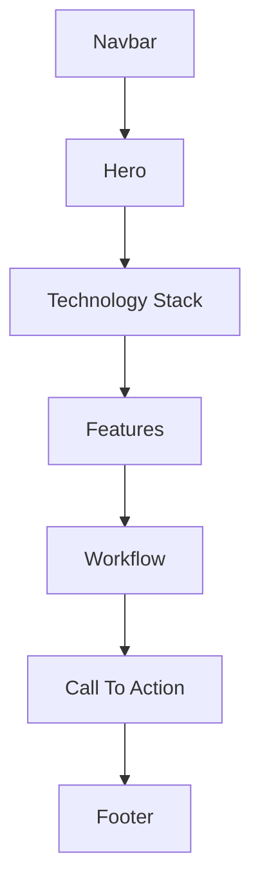
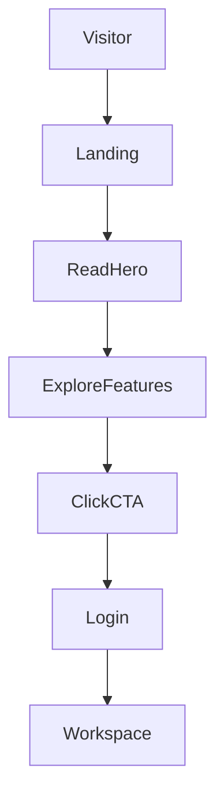
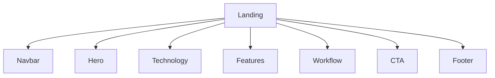
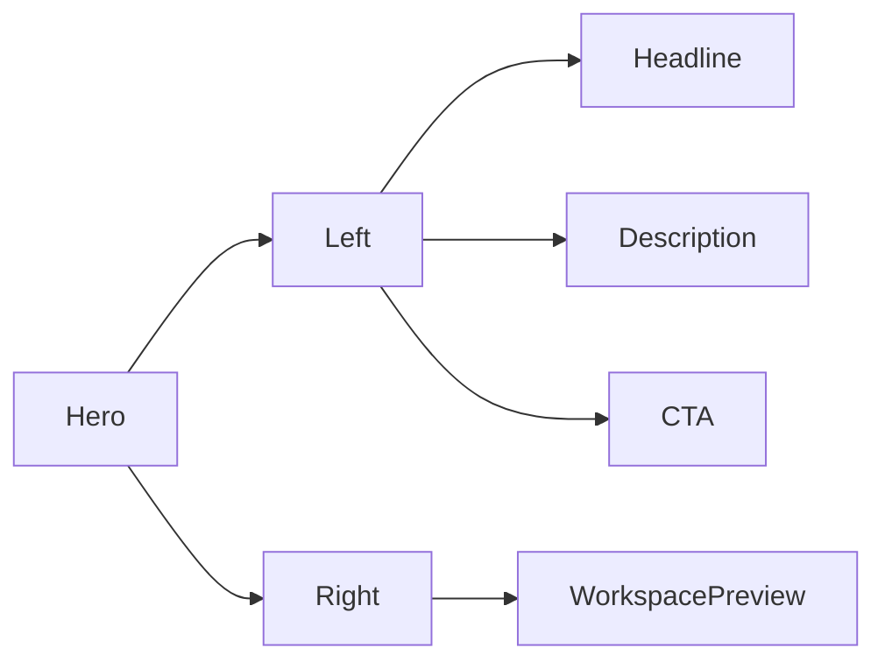
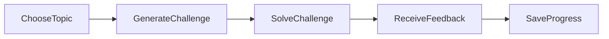

# Landing Page

Version: 1.0

Status: Draft

---

# Goal

Introduce GITGUD as an AI-powered developer workspace that helps developers improve backend skills through practical challenges.

Primary Action

Start Practicing

Secondary Action

GitHub Repository

---

# Target User

- Computer Science Students
- Junior Backend Developers
- Self-taught Developers
- Bootcamp Graduates

---

# User Goals

Visitors should understand:

- What GITGUD is
- Why it exists
- How it works
- Why they should use it

Within the first 10 seconds.

---

# Sections

1. Navbar

2. Hero

3. Technology

4. Features

5. Workflow

6. CTA

7. Footer

---

# Layout

Navbar

↓

Hero

↓

Technology Stack

↓

Features

↓

Workflow

↓

Call To Action

↓

Footer

## Navbar

Purpose

Provide navigation and authentication.

Components

- Logo
- GitHub
- Theme Toggle
- Sign In

Primary Action

Sign In

Notes

Navbar should remain fixed while scrolling.

## Hero

Layout

Two Columns

Left

- Heading
- Description
- CTA
- Secondary CTA

Right

Interactive Workspace Preview

Headline

Practice.
Build.
Improve.

Description

Practice backend through real-world coding challenges powered by AI.

Primary Button

Start Practicing

Secondary Button

GitHub Repository

Workspace Preview

Track

Backend

Topic

REST API

Difficulty

Intermediate

Button

Generate Challenge

## Technology Stack

Purpose

Show technologies used.

Items

- React
- Go
- PostgreSQL
- Gemini AI
- Docker
- Google Cloud Run

## Features

Grid

4 Cards

Feature 1

AI Challenge

Description

Generate backend challenges instantly.

---

Feature 2

Backend Focus

Description

Practice real backend concepts.

---

Feature 3

Progress Tracking

Description

Track your learning journey.

---

Feature 4

Developer Workspace

Description

Everything in one workspace.

## Workflow

Step 1

Choose Topic

↓

Step 2

Generate Challenge

↓

Step 3

Solve Challenge

↓

Step 4

Receive AI Feedback

↓

Step 5

Track Progress

## Call To Action

Headline

Ready to Become a Better Backend Developer?

Button

Start Practicing

## Footer

Logo

Copyright

GitHub

License

Made with

React

Go

Gemini

## Responsive

Desktop

Two Columns

Tablet

Single Column

Mobile

Stack Layout

Hero Preview moves below Hero Text.

## Theme

Support

- Light
- Dark
- System

## Motion

Navbar

Fade

Hero

Fade Up

Buttons

Scale on Hover

Cards

Fade Up

Duration

150–200ms

# Wireframe

# Landing Page Flow

## User Journey

---

## Landing Structure

---

## Hero Structure

---

## Learning Workflow

