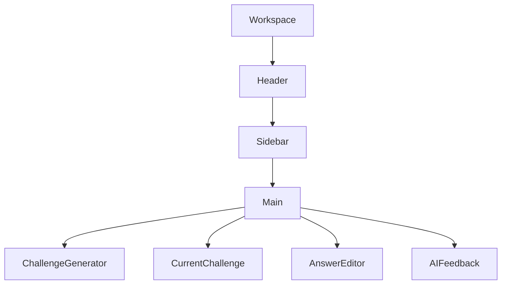
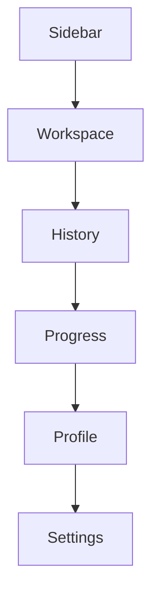
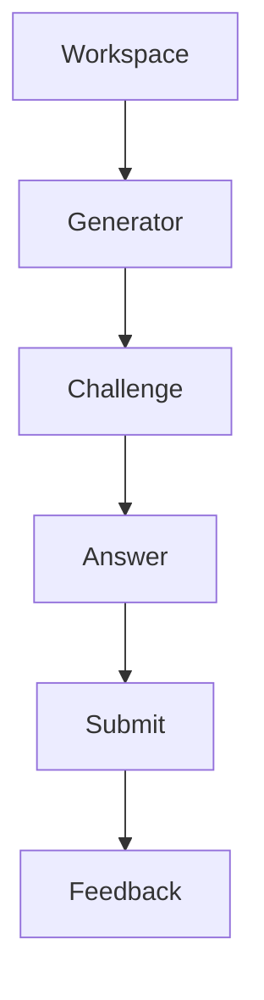

# Workspace

## Purpose

Main workspace for practicing backend challenges.

---

## Layout

```mermaid
flowchart TB

Workspace

--> Header

--> Sidebar

--> Main

Main --> ChallengeGenerator

Main --> CurrentChallenge

Main --> AnswerEditor

Main --> AIFeedback
```

---

## Sidebar

```mermaid
graph TD

Sidebar

--> Workspace

--> History

--> Progress

--> Profile

--> Settings
```

---

## Main Content

```mermaid
graph TD

Workspace

--> Generator

Generator --> Challenge

Challenge --> Answer

Answer --> Submit

Submit --> Feedback
```

---

## Primary Action

Generate Challenge